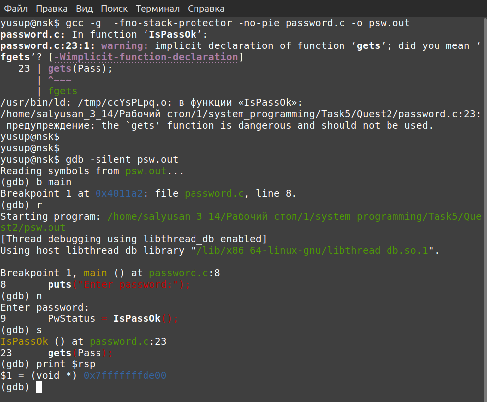

## Исследование стека функций с помощью **gdb**

1. Компилируется программа `password.c` с флагами **-g -fno-stack-protector -no-pie**
2. Запускается `gdb` для исполняемого файла
3. Ставится `breakpoint` на функцию `main`
4. Запускается `run`
5. Когда доходим до входа в функцию - входим в нее

   
     
6. Выводим и запоминаем указатель на стек `$rsp` и указатель `$rbp`
7. Выводим содержимое памяти около вершины стека до ввода пароля
9. Вводим 12 символов пароля например из букв 'D' (0x44) , 'U'(0x55)
10. Выводим содержимое памяти около вершины стека после ввода пароля, видим куда записались 12 символов. После них идет указатель `$rbp` 

   

11. Вызвав `dissasemble` видим что после `$rbp` идет адрес возврата из функции `IsPassOk()`. Также видим что после сравнения `cmpl` результата функции с нулем происходит ветвление через прыжок `jne` и нужный нам переход лежит по адресу `0x4011d8`

  
    
13. Выхожу из `gdb`
12. С помощью вспомогательной программы создал бинарный файл **"hack"** , который нужно перенаправить во вход исполняемого файла. В нем поместил массив из 28 чисел так, чтобы функция `gets` выйдя из установленного размера строки в нужном месте записала адрес перехода `0x4011d8`
13. Запускаю исполняемый файл с перенаправлением на вход созданного файла **"hack"** 
14. Получил требуемый результат: выполнилась ветка программы с выводом **"Access granted!"**

  

  

